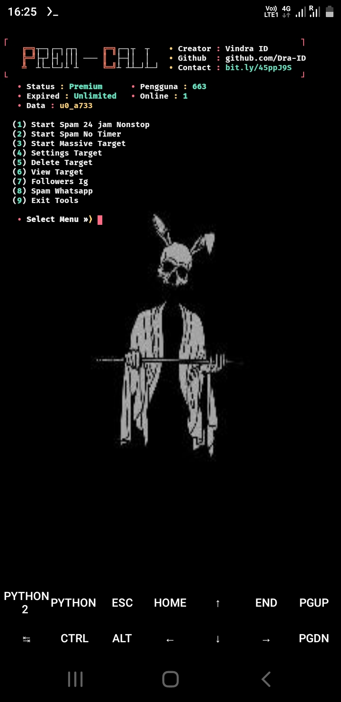
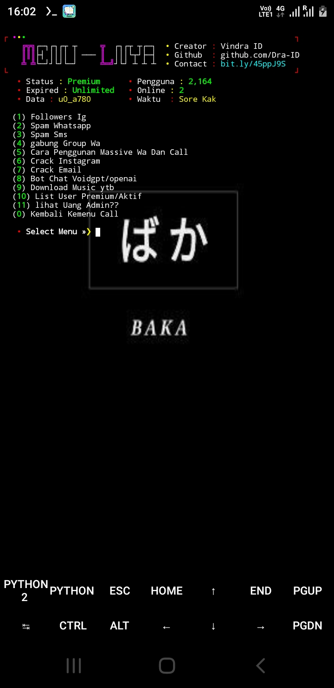

# Premium-Call 
  - 😍 Script This `Spam Call Premium!!!!`

DOWNLOAD TERMUX TERBARU 
<li><a href="https://www.mediafire.com/file/r1ay7mhb9j2toix/com.termux_118.zip/file">Termux_118</a></code></li> 
<p align="center">
  
  <a href="https://github.com/Dra-ID">

<details open>
  <summary><strong> Install Script(Dra-ID)</strong></summary>
  
```python
pkg update && pkg upgrade
pkg install python && pkg install python-pip
pkg install git
cd
rm -rf Premium-Call
git clone https://github.com/Dra-ID/Premium-Call
cd Premium-Call
ls
pip install -r requirements.txt
git pull
python run.py
```
  </details>
  
<details open>
  <summary><strong> Kalo Udah Install Di Atas jalanin yang di bawah (Dra-ID)</strong></summary>

  ```php
cd
cd Premium-Call
ls
pip install -r requirements.txt
git pull
python run.py
  ```
  </details>
  
  <p align="center">
  
  <a href="https://github.com/Dra-ID">
  
Follow Tiktok 
```bash
https://tiktok.com/@vindraid
```

</p>

<p align="center">
  
</p>

Menu 2

</p>

<p align="center">
  
</p>
